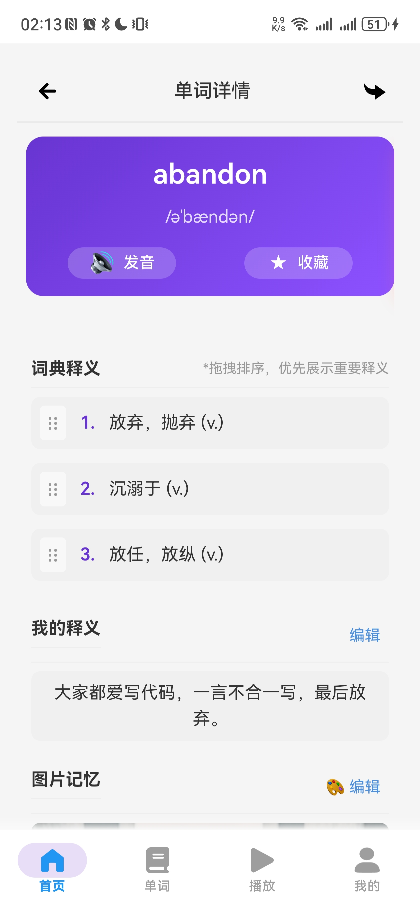
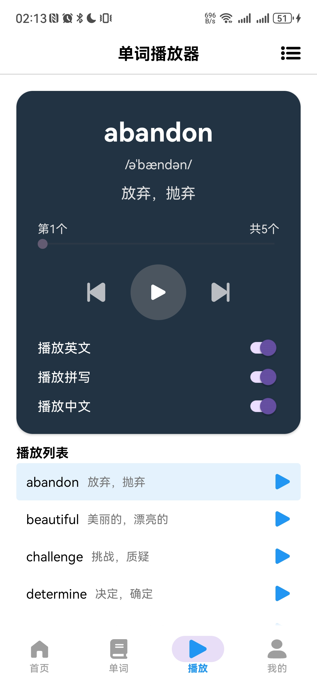

# MemoryWordWorkshop - 忆词工坊

[](https://opensource.org/licenses/MIT)
[](https://kotlinlang.org)
[](https://android-arsenal.com/api?level=26)

MemoryWordWorkshop 是一款创新的单词学习应用，结合了单词记忆、音频播放和歌词学习功能，帮助用户通过音乐和上下文更高效地记忆单词。

## ✨ 主要功能

- **智能单词学习**：基于记忆曲线的单词复习系统
- **歌词记忆法**：通过歌曲歌词学习单词，增强记忆效果
- **多源导入**：支持从音乐平台、本地文件和手动创建歌单
- **播放控制**：单词播放、进度控制、播放选项定制
- **学习分析**：可视化学习进度和记忆效果
- **跨平台同步**：学习数据云端同步

## 📱 截图展示

| 单词学习                                          | 词本管理                                          | 播放控制                                          |
|-----------------------------------------------|-----------------------------------------------|-----------------------------------------------|
|  |  |  |

## 🚀 快速开始

### 前提条件

- Android Studio 2025.1.3+
- JDK 17+
- Android SDK 36 (Android 16)

### 安装步骤

1. 克隆仓库：
    ```bash
    git clone https://github.com/Dawn-666/MemoryWordWorkshop.git
    ```
2. 打开 Android Studio 并导入项目
3. 在 `local.properties` 文件中添加您的 API 密钥（如果需要）：
    ```properties
    SPOTIFY_CLIENT_ID=your_spotify_client_id
    SPOTIFY_CLIENT_SECRET=your_spotify_client_secret
    ```
4. 构建并运行应用

## 🛠️ 项目结构

```
MemoryWordWorkshop/
├── app/ # 主应用模块
│ ├── src/main/
│ │ ├── java/ # Kotlin 源代码
│ │ ├── res/ # 资源文件
│ │ └── assets/ # 静态资源
│ └── build.gradle # 模块构建配置
├── build.gradle # 项目构建配置
├── settings.gradle # 项目设置
├── LICENSE # MIT 许可证
└── README.md # 项目文档
```

## 🧩 技术栈

- **语言**: Kotlin 100%
- **架构**: MVVM + Clean Architecture
- **异步**: Kotlin Coroutines + Flow
- **依赖注入**: Hilt
- **数据库**: Room + SQLDelight
- **网络**: Retrofit + OkHttp
- **UI**: Jetpack Compose + Material 3
- **音频**: ExoPlayer
- **分析**: Firebase Analytics
- **测试**: JUnit, MockK, Espresso

## 🤝 如何贡献

我们欢迎各种形式的贡献！请阅读我们的贡献指南：

1. Fork 项目仓库
2. 创建您的功能分支 (`git checkout -b feature/AmazingFeature`)
3. 提交您的更改 (`git commit -m 'Add some AmazingFeature'`)
4. 推送到分支 (`git push origin feature/AmazingFeature`)
5. 打开 Pull Request

### 贡献指南

- 遵循 [Kotlin 编码规范](https://kotlinlang.org/docs/coding-conventions.html)
- 为所有公共 API 添加文档注释
- 为新功能编写单元测试
- 保持代码简洁和模块化

## 📄 许可证

本项目采用 MIT 许可证 - 详情请参阅 [LICENSE](LICENSE) 文件。

## 📬 联系我们

如有任何问题或建议，请联系我们：

- 邮箱: dawn666@qq.com